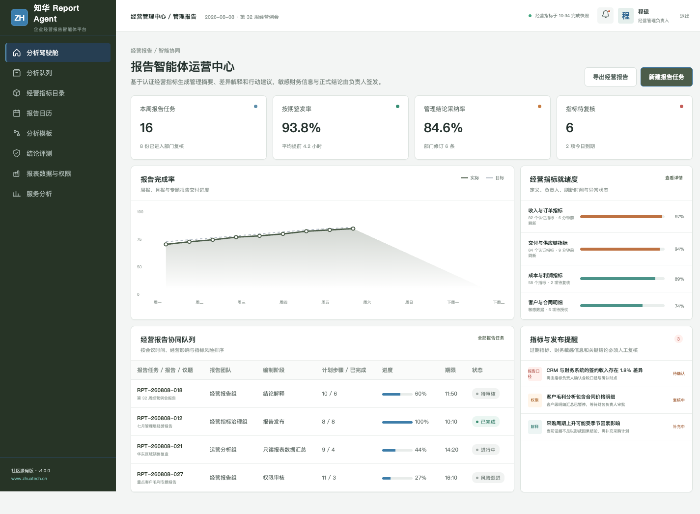
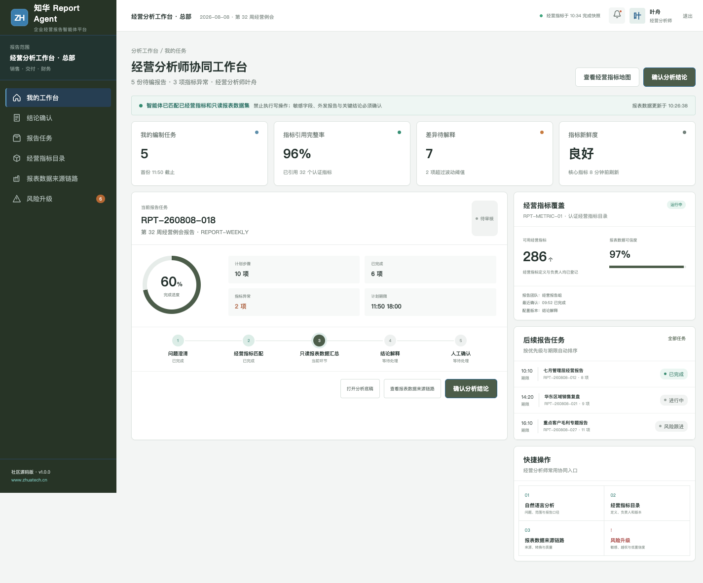

# ReportAgent · 知华科技经营报告智能体

## 企业级增强：经营报告关账治理

新增数据源对账覆盖率、指标血缘、重大差异解释、责任人签署和报告期间锁定校验。系统以 `PUBLISH / REVIEW / BLOCKED` 三态控制报告发布，保留阻断原因和后续动作，详见 [经营报告关账治理](docs/ENTERPRISE_REPORT_CLOSE.md)。

**让报告更及时，让每个数字都能追溯到定义、负责人和刷新时间。**

[知华科技（上海如静知华信息科技有限公司）](https://www.zhuatech.cn/)面向中小企业信息化与 AI 转型发布的经营报告 Agent 社区源码工程。

## 这个项目解决什么

周报、月报和管理层专题报告经常耗费大量时间在取数、对口径、解释波动和追行动项上。ReportAgent 用认证指标快照组织这些工作，生成管理摘要和差异解释草案，同时把关键判断、敏感财务信息和最终发布留给负责人。

运营中心管理报告计划、指标新鲜度、异常状态、审阅进度和发布版本。

分析师端聚焦当前报告的指标快照、差异解释、管理摘要、行动建议与签发责任。

## 报告流水线

`报告计划 → 指标快照 → 异常识别 → 差异解释 → 管理摘要 → 人工审阅 → 版本发布 → 行动跟踪`

主要功能包括：

- 周报、月报、专题报告计划与模板
- 经营指标定义、负责人和刷新状态
- 数据快照、波动提示与解释草稿
- 财务敏感字段按角色脱敏
- 报告审阅、签发、版本与审计记录
- 会后行动项、责任人和完成状态跟踪

`ReportReleaseGuardService` 会拦截过期指标和未经确认的敏感财务信息，确保演示中的 Agent 只能起草，不能直接发布正式经营结论。

## 技术规格

| 层 | 技术 |
| --- | --- |
| Web / H5 | Vue 3、Pinia、Vue Router、Axios、Vite |
| Java API | Java 21、Spring Boot、Security、JWT、JPA |
| 数据层 | MySQL 8、Flyway，测试使用 H2 |
| 部署 | Docker Compose、Nginx、环境变量配置 |
| 质量 | 后端集成测试、前端生产构建、CI、敏感信息检查 |

~~~bash
cd frontend
npm install
npm run dev:demo
~~~

访问 `http://localhost:5173`；使用 `planner / Demo@2026` 查看管理端，使用 `operator / Demo@2026` 查看经营分析师端。

## 使用许可

本项目**仅限个人学习、研究和非商业技术交流，不得商用**。企业生产部署、内部经营使用、软件项目交付、SaaS、收费服务、二次销售或品牌替换均需取得上海如静知华信息科技有限公司书面授权，具体以 [LICENSE](LICENSE) 为准。

需要经营分析 Agent 深度定制、指标平台集成、私有化部署或软件外包，请访问[知华科技官网](https://www.zhuatech.cn/)或扫码联系。

| 技术咨询 | 商业合作 |
| --- | --- |
|  |  |

SEO：Report Agent、经营分析智能体、自动化经营报告、管理驾驶舱、企业指标平台、Java Vue AI 项目、知华科技。
